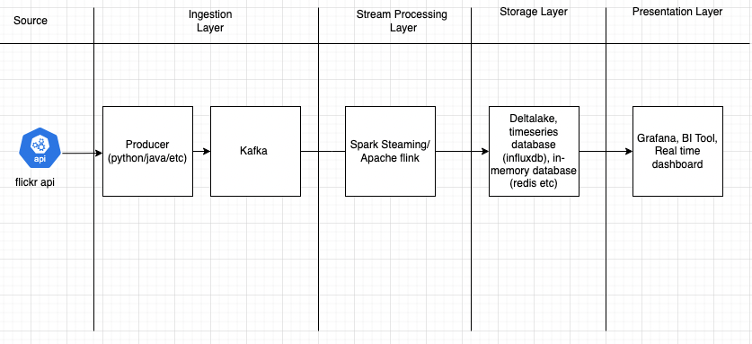
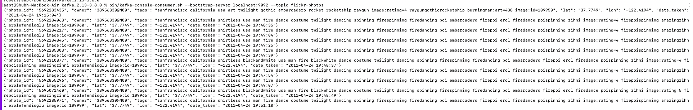
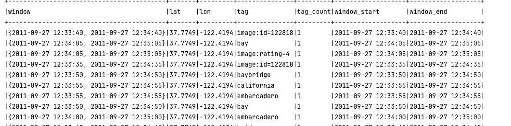
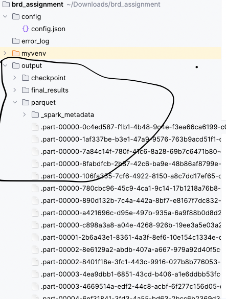
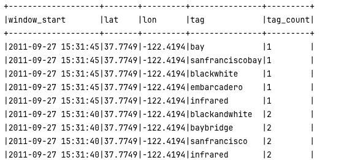
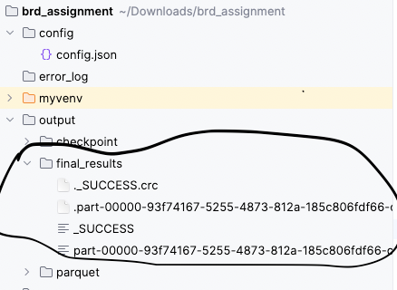

## Sentiment Analysis

### Introduction
This application is designed help Big`brothers. How happy are people when looking at photos originating from a certain geographic area currently? Big Brother Inc. wants to prevent an uprising by monitoring this in real time.

### Core Problem statement 
  * Photos should be analysed in real time from flikr api (< 5 seconds)
  * Solution should be scalable

### Solution Design
Solution design is as follows
- Ingestion Layer (Read photos data from flickr API and send it to kafka topic)
- Streaming Processing Layer (Process these message)
- Storage layer (store sentiments)
- Presentation Layer (See the live sentiments or top N tags)

### Detailed Solution Design
* Ingestion Layer
  * Read photo data from flickr API and send this to kafka topic

* Stream Processing 
  * Consume messages from kafka topic and use spark streaming to analyse the sentiments or top tags
  Here we are using sliding window functionality to read in every 5 seconds interval for last 60 seconds messages to find out the top tags. 
  In this step all tags counts are being computed for last 60 seconds window based on time_taken info of the messages/photos.
  (Here watermarking is being used for handling late data arrival)

* Storage layer 
  * This computed data is then stored in parquet files for simplicity purpose. Ideally it has to be stored in deltalake or in-memory database like redis or timeseries database like influx db for scalability and faster reading purpose.
  This data is being stored locally at output/parquet folder

* Presentation layer 
  * At the last in this solution for simplicity purpose; Parquet files are being read by python program and final output for top tags are being presented on console and also saved in output/final_results folder.

## Instructions on how to run 

#### Pre-requisite
* python3 should be installed and can be recognised from your shell (version => 3.12)
  (This code and steps are tested on Mac m1, may be minor adjustments are required for running on any other machine)
* Java must be installed  (version 1.8=>) 
  * you can install with `brew install openjdk`
  * check hava version `java -version`
       should be "java version "1.8.0_202" or higher version
* Kafka must also be set up. Please follow the below steps
  * Go to terminal 
    * `wget https://downloads.apache.org/kafka/3.8.0/kafka_2.13-3.8.0.tgz` (if wget is not installed then install it with `brew install wget`)
    *  extract `tar -xzf kafka_2.13-3.8.0.tgz.1`
    * go inside kafka folder `cd  kafka_2.13-3.8.0` 
    * start zookeeper `bin/zookeeper-server-start.sh config/zookeeper.properties` 
    * start kafka server `bin/kafka-server-start.sh config/server.properties` 
    * create topic `bin/kafka-topics.sh --create --topic flickr-photos --bootstrap-server localhost:9092 --partitions 1 --replication-factor 1` 
    * run console consumer to see the actual messages `bin/kafka-console-consumer.sh --topic flickr-photos --from-beginning --bootstrap-server localhost:9092`
    * keep this terminal for later to see if there are any messages in this topic

#### Steps to run

1. Download the zip file
2. Unzip folder
3. go inside unzip folder via terminal  `(cd bdr_assignment ) `
4. create virtual environment (in terminal)
   1. `python3 -m venv myenv` 
   2. `source myenv/bin/activate`
5. install python dependency from requirements.txt (in terminal)
   1. `pip install --upgrade pip` 
   2. `pip install -r requirements.txt`
6. run unit test in terminal 
      1. please replace 'fullpath' like '/Users/aapt/Downloads/' and run
         `export PYTHONPATH=$PYTHONPATH:<fullpath>/brd_assignment/src`
      2. `python -m unittest tests/test_flickr_ingestion.py`
      3. `python -m unittest tests/test_stream_processing.py`

9. run python scripts (in terminal)
   1. Go to src folder `cd src`
        run  `python3 flickr_ingestion.py` 
   2. Go to open other terminal go inside src folder and 
      1. run `source myenv/bin/activate`
      2. run `python3 stream_processing.py`
   3. Go to open other terminal go inside src folder and 
      1. run `source myenv/bin/activate`
      2. run `python3 presentation_layer.py`

